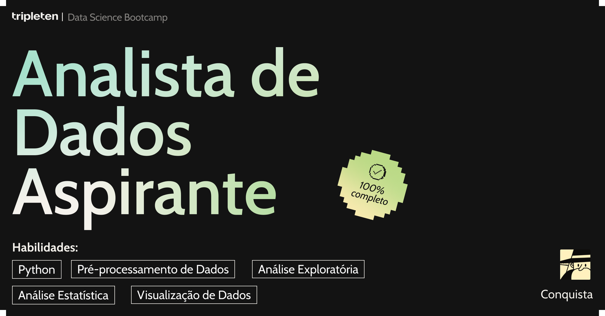
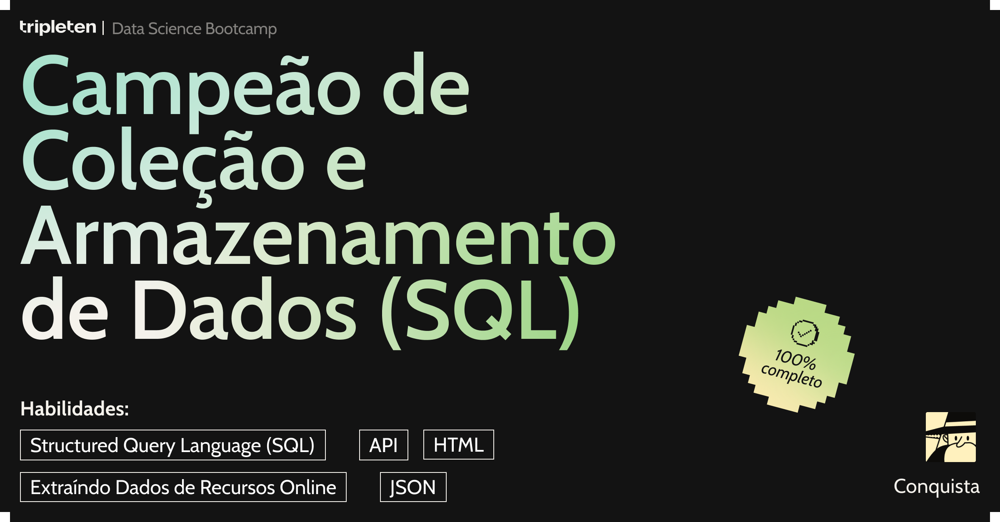

## Olá, Sou Heury 👋

Trabalhei por vários anos como Gestor de Ensino a Distância e Contador, mas sempre
me interessei pela área de Tecnologia, em especial Programação de Sistemas e Ambientes Virtuais.

Atualmente, participei de um Boot Camp em Análise de Dados pela Tripleten.  
Este curso, que é uma jornada integrativa, possui foco em Python e suas principais bibliotecas, voltadas para a extração, tratamento, apresentação e análise de dados. 
Aborda, além das habilidades técnicas necessárias, também a compreensão de negócios, tomada de decisões e comunicação assertiva. 
Além do curso, busquei aperfeiçoamento na linguagem Python, Powerbi, DAX, SQL Server, 

Em meus projetos, desenvolvi habilidades em Python, Bibliotecas Python para Coleta e Armazenamento de dados (SQL), Análise Estatística de Dados, Análise de Negócio.

**🛠️Principais Ferramentas que utilizo:** 
VSCODE 
Jupyter Notebook 
Google Colab 
Excel 
Github

⏳**Estou aprofundando meus conhecimentos em:** 
Ferramentas de Desenvolvimento de Software 
Automação 
Machine Learning 

"Na análise de dados, a única coisa que mente mais que a média... 
é a média sem o desvio padrão!" 😄

**MINHAS TECNOLOGIAS** 

 

**MEUS CERTIFICADOS**

 

**Entre em contato comigo aqui**: 
https://www.linkedin.com/in/heurypy/
