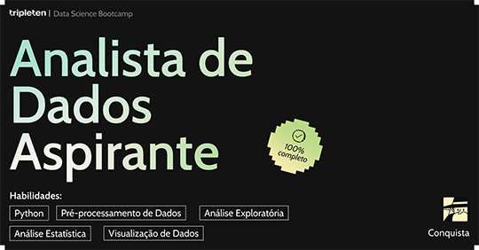
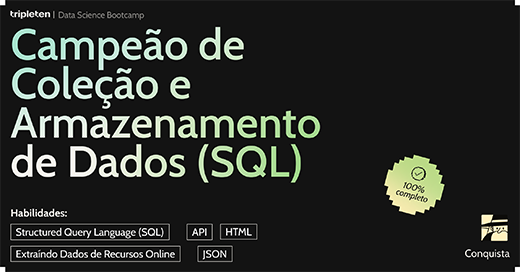
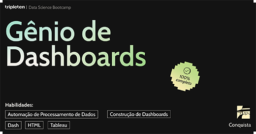
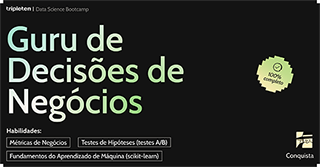

## Hi, I´m Heury.
I am a Junior Data Analyst, Accountant, and Teacher with several years of experience in Distance Education. 
Today, I apply my analytical and business perspective to transform data into insights that support strategic decision-making. 

Throughout my professional journey, I have always had a strong interest in Technology, especially programming, automation, and digital environments. 
This interest naturally evolved into Data Analysis, a field in which I have been specializing. 

In my projects, I have developed skills in Python, Python libraries for data collection and storage (SQL), Statistical Data Analysis, and Business Analysis. 

**🛠️Main Tools I Use:** 
VSCODE 
Jupyter Notebook 
Google Colab 
Excel 
Github 
Tableau 
Power BI

⏳**I am currently deepening my knowledge in:** 
Ferramentas de Desenvolvimento de Software 
Automação 
Machine Learning 

"In data analysis, the only thing that lies more than the average…
is the average without the standard deviation!" 😄

## Olá, Sou Heury 👋

Sou Analista de Dados Júnior, Contador e Professor com experiência de vários anos com Ensino a Distância. 
Hoje, aplico minha visão analítica e de negócios para transformar dados em insights que apoiam decisões estratégicas. 

Durante minha trajetória profissional, sempre tive forte interesse por Tecnologia, especialmente por programação, automação e ambientes digitais. 
Esse interesse evoluiu naturalmente para a Análise de Dados, área na qual venho me especializando. 

Em meus projetos, desenvolvi habilidades em Python, Bibliotecas Python para Coleta e Armazenamento de dados (SQL), Análise Estatística de Dados, Análise de Negócio.

**🛠️Principais Ferramentas que utilizo:** 
VSCODE 
Jupyter Notebook 
Google Colab 
Excel 
Github 
Tableau 
Power BI

⏳**Estou aprofundando meus conhecimentos em:** 
Ferramentas de Desenvolvimento de Software 
Automação 
Machine Learning 

"Na análise de dados, a única coisa que mente mais que a média... 
é a média sem o desvio padrão!" 😄

**MINHAS TECNOLOGIAS** 

 

**MEUS CERTIFICADOS** 

 

**Entre em contato comigo aqui**: 
https://www.linkedin.com/in/heurypy/
